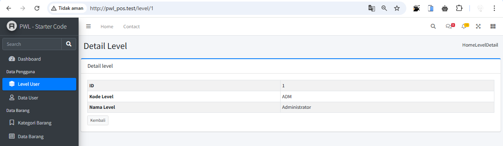
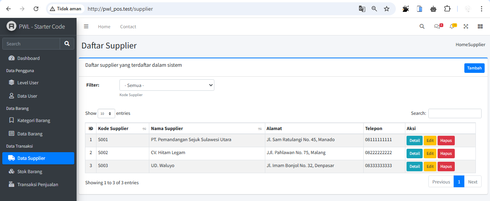
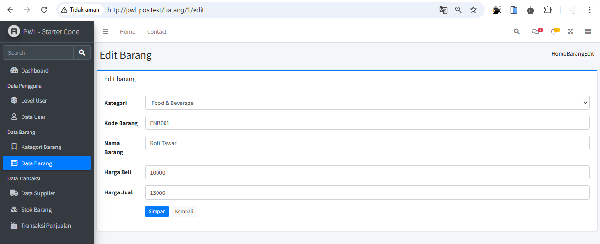

# Praktikum PWL_POS - J5 New Laravel 10

## Praktikum 1 - Layouting AdminLTE

1. Unduh AdminLTE v3.2.0 dan ekstrak ke folder `public/adminlte`.
2. Akses melalui `http://localhost/PWL_POS/public/adminlte`.

3. Pisahkan layout menjadi beberapa file di `resources/views/layouts/`:
   - `template.blade.php`
   - `header.blade.php`
   - `sidebar.blade.php`
   - `breadcrumb.blade.php`
   - `footer.blade.php`
4. Modifikasi `template.blade.php` agar memanggil file layout yang dibuat.
5. Commit dan push ke GitHub.


## Praktikum 2 - Penerapan Layouting
1. Buat `WelcomeController.php` dan `welcome.blade.php`.
2. Modifikasi `breadcrumb.blade.php` dan `sidebar.blade.php`.
3. Tambahkan routing di `web.php`.
4. Jalankan `http://localhost/PWL_POS/public` dan pastikan layout berjalan.

5. Commit dan push ke GitHub.

## Praktikum 3 - Implementasi jQuery DataTables
1. Install Yajra DataTables:
   ```bash
   composer require yajra/laravel-datatables
   ```
2. Buat fungsi `index()` di `UserController.php`.
3. Buat `user/index.blade.php` untuk menampilkan DataTables.
4. Tambahkan konfigurasi DataTables di `template.blade.php`.
5. Implementasikan AJAX untuk menangkap data di `UserController.php`.
6. Jalankan `http://localhost/PWL_POS/public/user` untuk melihat hasilnya.

   ```bash
   No 8: akan muncul data user
   ```
7. Tambah data

   ```bash
   No 12: kita bisa menambahkan data user disini
   ```
8. Jalankan `http://localhost/PWL_POS/public/user/100` untuk melihat hasilnya jika mengetikkan id yang salah.

   ```bash
   No 16: akan muncul pesan kesalahan karena data memang tidak ada 
   ```
9. Detail

10. Edit

      ```bash
      No 20: disini kita bisa mengedit data user, namun untuk password nya tidak harus diisi, jika tidak diisi maka password akan tetap menggunakan yang lama 
      ```
11. Delete

      ```bash
      No 24: disini kita bisa menghapus data user, yang nantinya akan muncul pesan konfirmasi sebelum data benar benar terhapus
      ```
12. Commit dan push ke GitHub.

## Praktikum 4 - Filtering DataTables
1. Tambahkan kategori filtering di `index()` pada `UserController.php`.
2. Tambahkan dropdown filtering di `user/index.blade.php`.
3. Modifikasi fungsi `list()` di `UserController.php` untuk menangkap filter.
4. Jalankan `http://localhost/PWL_POS/public/user` dan coba fitur filtering.

5. Commit dan push ke GitHub.

## Tugas
Implementasikan layout dan DataTables untuk:
- Tabel `m_level`
- Tabel `m_kategori`
- Tabel `m_supplier`
- Tabel `m_barang`

Jawab:
- Tabel `m_level`





- Tabel `m_kategori`


- Tabel `m_supplier`



- Tabel `m_barang`




