# PWL_POS - AJAX Form & Client Validation

## Praktikum

### 1. Modal AJAX Tambah Data
- Menambahkan data **user** menggunakan modal form dengan AJAX.
- Validasi form dilakukan dengan **jQuery Validation**.
- SweetAlert digunakan untuk notifikasi keberhasilan/gagal.

📌 **File yang diubah/dibuat:**
- `resources/views/user/index.blade.php`
- `resources/views/user/create_ajax.blade.php`
- `app/Http/Controllers/UserController.php`
- `routes/web.php`

- Hasil:<br>

```cmd
Akan muncul tombol baru 'Tambah Ajax'
```
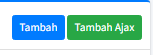
```cmd
Modal Ajax
```
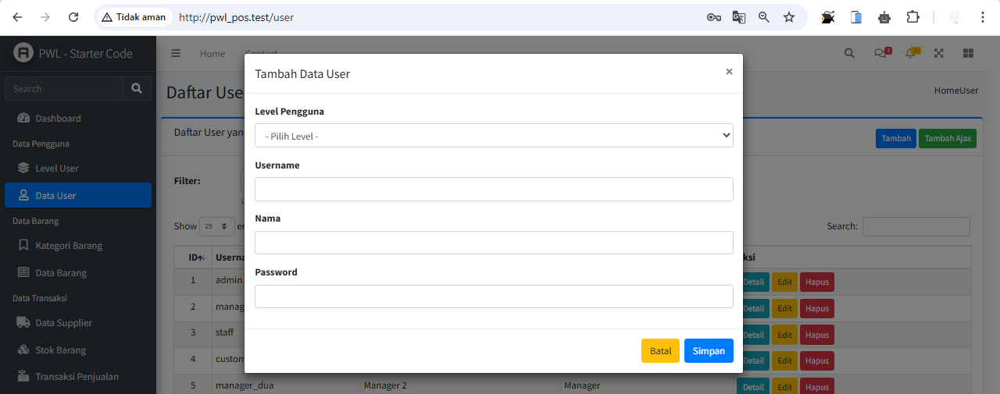
```cmd
Ketika sudah diisi dan klik simpan
```
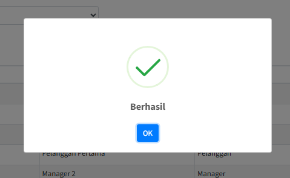


### 2. Modal AJAX Edit Data
- Menggunakan AJAX untuk menampilkan modal edit data user.
- Data yang diubah dikirim ke server dengan metode **PUT**.
- Validasi dilakukan menggunakan jQuery Validation.

📌 **File yang diubah/dibuat:**
- `resources/views/user/edit_ajax.blade.php`
- `app/Http/Controllers/UserController.php`
- `routes/web.php`

- Hasil:<br>

```cmd
Tampilan Modal ketika meng-klik tombol edit
```
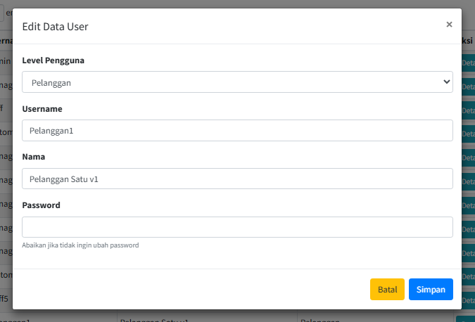
```cmd
Ketika data dirubah dan disimpan
```
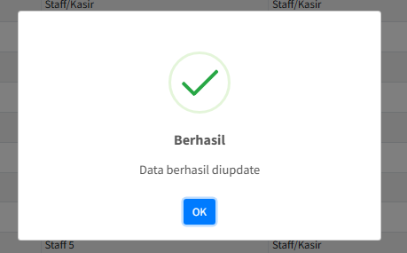

### 3. Modal AJAX Hapus Data
- Konfirmasi penghapusan data menggunakan modal AJAX.
- Setelah konfirmasi, data akan dihapus menggunakan metode **DELETE**.

📌 **File yang diubah/dibuat:**
- `resources/views/user/confirm_ajax.blade.php`
- `app/Http/Controllers/UserController.php`
- `routes/web.php`

- Hasil:<br>

```cmd
Tampilan Modal ketika meng-klik tombol delete
```
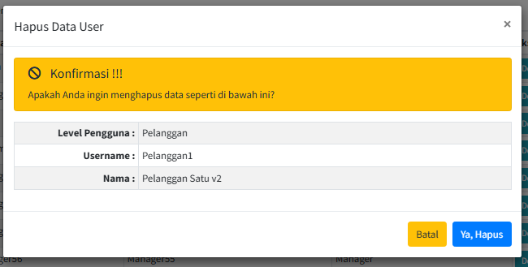
```cmd
Tampilan ketika mengklik "Ya, Hapus"
```
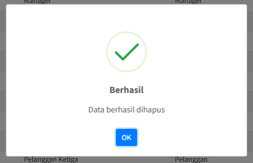

## Tugas
Implementasikan  Ajax Form dan Client Validation dengan 
jQuery Validation untuk:
- Tabel `m_level`
- Tabel `m_kategori`
- Tabel `m_supplier`
- Tabel `m_barang`

Jawab :
## Tabel `m_level`
```
Tambah Ajax Level
```
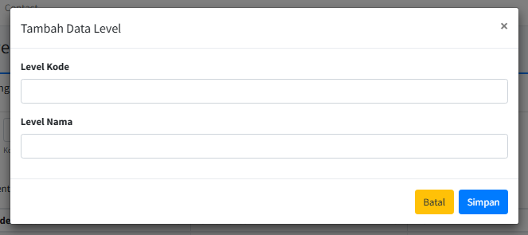
```
Detail Ajax Level
```
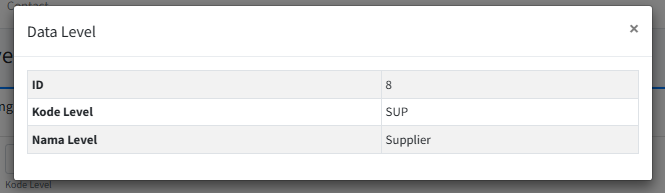
```
Edit Ajax Level
```
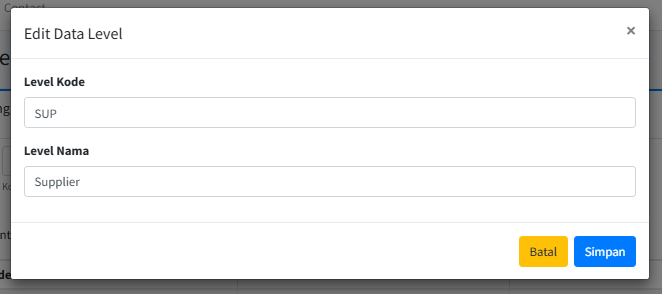
```
Hapus Ajax Level
```
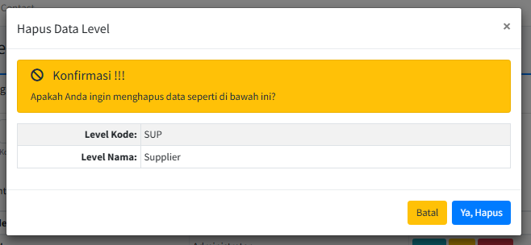

## Tabel `m_kategori`
```
Tambah Ajax Kategori
```
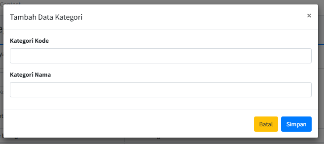
```
Detail Ajax Kategori
```
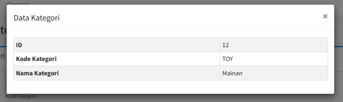
```
Edit Ajax Kategori
```
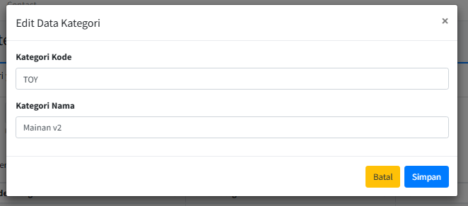
```
Hapus Ajax Kategori
```
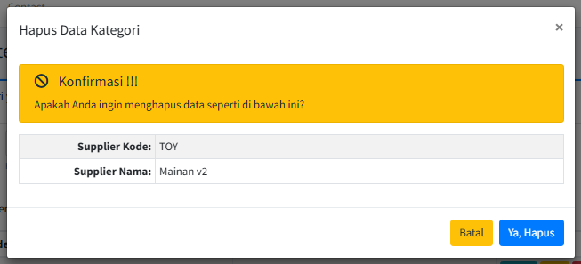

## Tabel `m_supplier`
```
Tambah Ajax Supplier
```
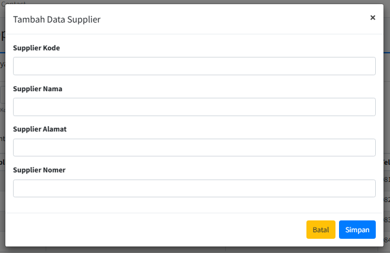
```
Detail Ajax Supplier
```
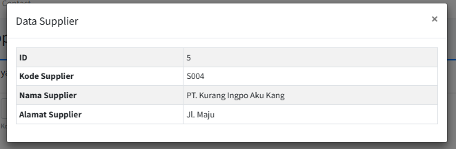
```
Edit Ajax Supplier
```
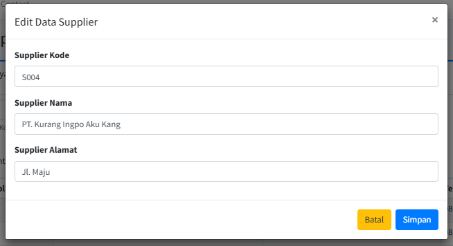
```
Hapus Ajax Supplier
```
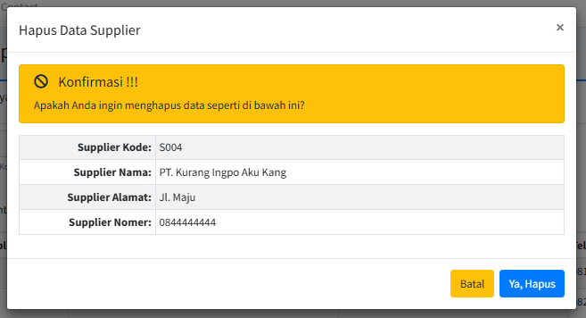

## Tabel `m_barang`
```
Tambah Ajax Barang
```
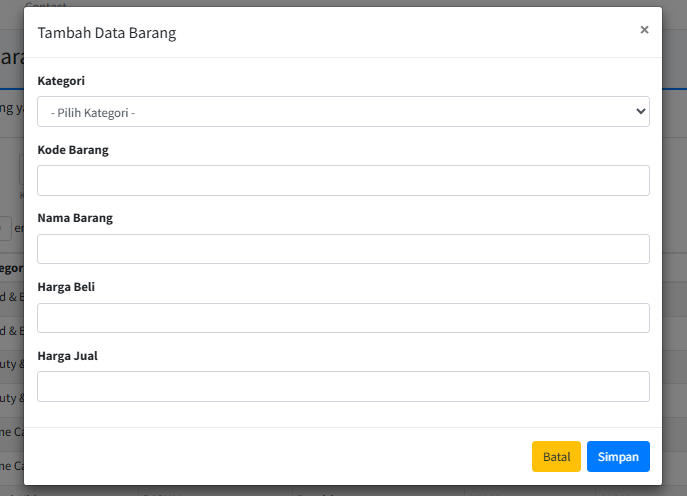
```
Detail Ajax Barang
```
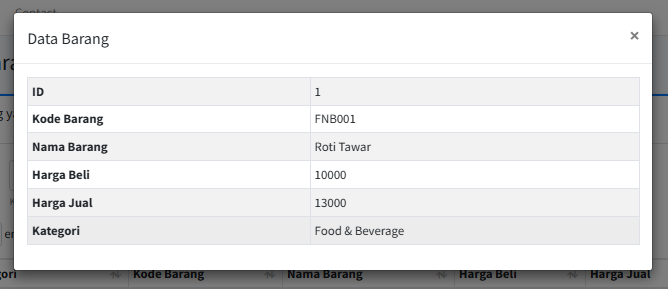
```
Edit Ajax Barang
```
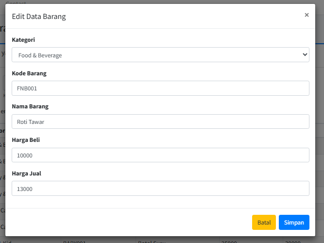
```
Hapus Ajax Barang
```
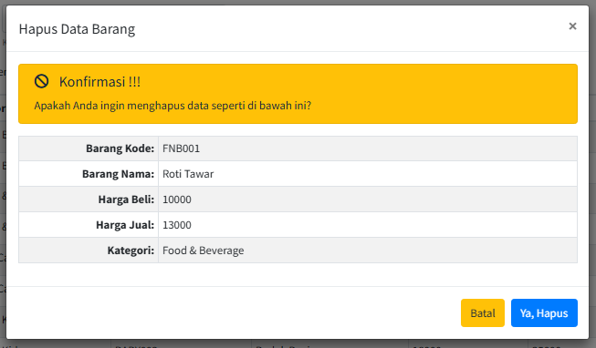