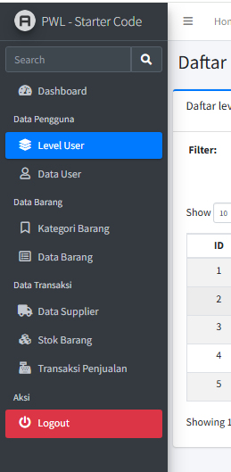

# PWL_POS J7 - Authentication dan Authorization di Laravel

### Praktikum 1 – Implementasi Authentication : 
- Modifikasi file konfigurasi autentikasi di `config/auth.php` agar sesuai dengan model untuk tabel `m_user`.
- Modifikasi `UserModel.php` agar mendukung proses autentikasi.
- Pembuatan `AuthController.php` untuk memproses login dan logout.
- Pembuatan view untuk halaman login di `resources/views/auth/login.blade.php` dengan tampilan yang diambil dari template AdminLTE.

📌 **File yang diubah/dibuat:**
- `config/auth.php`
- `app/Models/UserModel.php`
- `app/Http/Controllers/AuthController.php`
- `resources/views/auth/login.blade.php`

Hasil:<br>

```cmd
Tampilan login muncul jika mengakses /public
```


### Tugas 1 – Implementasi Authentication :
1. Silahkan implementasikan proses login pada project kalian masing-masing (Sudah)
2. Silahkan implementasi proses logout pada halaman web yang kalian buat 
```cmd
disini saya tambahkan tombol logout pada sidebar, yang dimana ketika di klik maka akan mengarah ke halaman login
```


3. Amati dan jelaskan tiap tahapan yang kalian kerjakan, dan jabarkan dalam laporan (Sudah diatas)
4. Submit kode untuk impementasi Authentication pada repository github kalian ([Link Commit](https://github.com/JihaR15/WEBLNJTLARAVEL10/commits/main/Minggu%207/PWL_POS)) 


