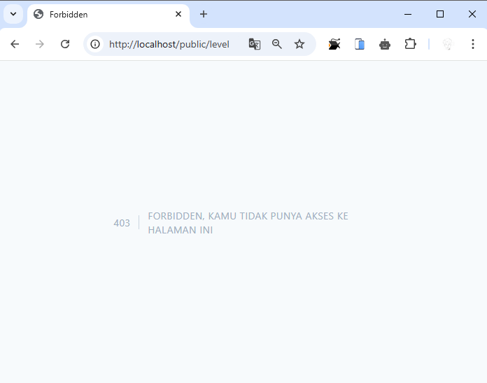

# PWL_POS J7 - Authentication dan Authorization di Laravel

### Praktikum 1 – Implementasi Authentication : 
- Modifikasi file konfigurasi autentikasi di `config/auth.php` agar sesuai dengan model untuk tabel `m_user`.
- Modifikasi `UserModel.php` agar mendukung proses autentikasi.
- Pembuatan `AuthController.php` untuk memproses login dan logout.
- Pembuatan view untuk halaman login di `resources/views/auth/login.blade.php` dengan tampilan yang diambil dari template AdminLTE.

📌 **File yang diubah/dibuat:**
- `config/auth.php`
- `app/Models/UserModel.php`
- `app/Http/Controllers/AuthController.php`
- `resources/views/auth/login.blade.php`

Hasil:<br>

```
Tampilan login muncul jika mengakses /public
```


### Tugas 1 – Implementasi Authentication :
1. Silahkan implementasikan proses login pada project kalian masing-masing (Sudah)
2. Silahkan implementasi proses logout pada halaman web yang kalian buat 
```
disini saya tambahkan tombol logout pada sidebar, yang dimana ketika di klik maka akan mengarah ke halaman login
```


3. Amati dan jelaskan tiap tahapan yang kalian kerjakan, dan jabarkan dalam laporan (Sudah diatas)
4. Submit kode untuk impementasi Authentication pada repository github kalian ([Link Commit](https://github.com/JihaR15/WEBLNJTLARAVEL10/commits/main/Minggu%207/PWL_POS)) 

### Praktikum 2 – Implementasi Authorization di Laravel dengan Middleware :
- Modifikasi `UserModel.php` dengan menambahkan properti/relasi yang mendukung pengecekan role/level.
- Pembuatan middleware `AuthorizeUser.php` menggunakan perintah:
    ```bash
    php artisan make:middleware AuthorizeUser
    ```
- Edit middleware `AuthorizeUser.php`
- Registrasi middleware di file `app/Http/Kernel.php`.
- Modifikasi file `routes/web.php` untuk menerapkan middleware pada route yang ingin dilindungi, misalnya dengan menambahkan keterangan seperti `authorize:ADM` untuk akses administrator.

📌 **File yang diubah/dibuat:**
- `app/Models/UserModel.php`
- `app/Http/Middleware/AuthorizeUser.php`
- `app/Http/Kernel.php`
- `routes/web.php`

Hasil:<br>

```
Akses ke route level hanya dapat dilakukan oleh user dengan level "ADM" (Administrator). selain "ADM" maka akan muncul tampilan error 403 seperti ini
```


### Tugas 2 –  Implementasi Authorization :
1. Apa yang kalian pahami pada praktikum 2 ini? 
    ```
    Jadi disini kita membuat middleware AuthorizeUser untuk memfilter akses berdasarkan level user. Di setiap route yang ingin dibatasi aksesnya, kita menambahkan middleware seperti authorize:ADM. Middleware akan mengecek level user dari database, dan jika tidak sesuai, akan diarahkan ke halaman error. Ini mencegah user tidak berwenang mengakses menu admin.
    ```
2. Amati dan jelaskan tiap tahapan yang kalian kerjakan, dan jabarkan dalam laporan (Sudah)
3. Submit kode untuk impementasi Authorization pada repository github kalian. 

