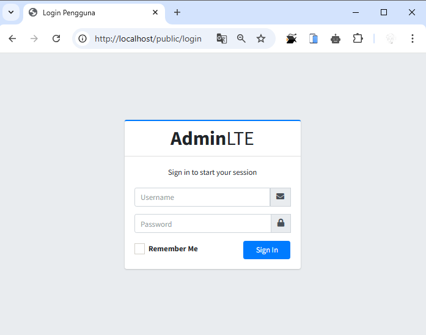

# PWL_POS J7 - Authentication dan Authorization di Laravel

### Praktikum 1 – Implementasi Authentication : 
- Modifikasi file konfigurasi autentikasi di `config/auth.php` agar sesuai dengan model untuk tabel `m_user`.
- Modifikasi `UserModel.php` agar mendukung proses autentikasi.
- Pembuatan `AuthController.php` untuk memproses login dan logout.
- Pembuatan view untuk halaman login di `resources/views/auth/login.blade.php` dengan tampilan yang diambil dari template AdminLTE.

📌 **File yang diubah/dibuat:**
- `config/auth.php`
- `app/Models/UserModel.php`
- `app/Http/Controllers/AuthController.php`
- `resources/views/auth/login.blade.php`

Hasil:<br>

```cmd
Tampilan login muncul jika mengakses public
```


