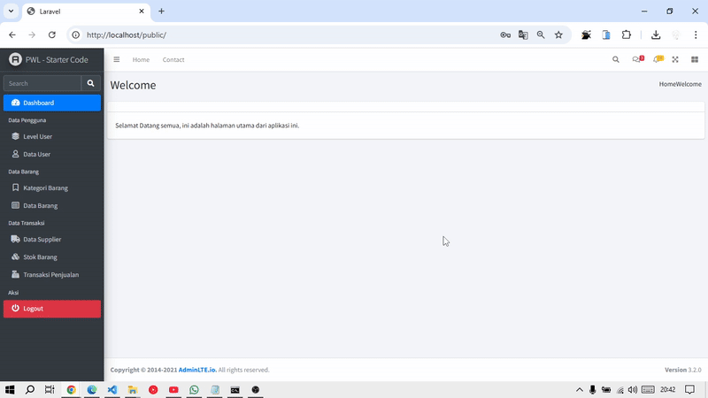
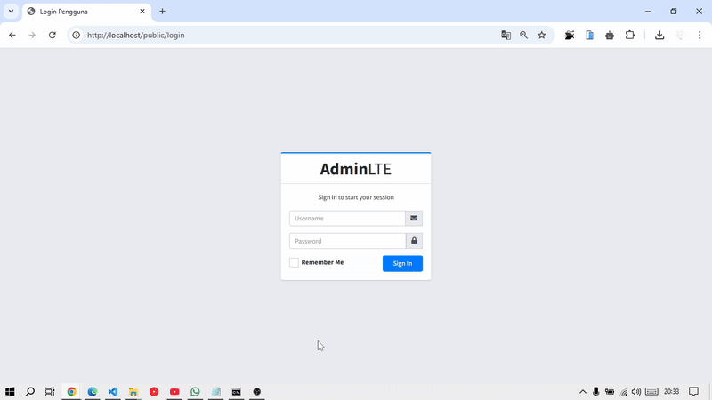
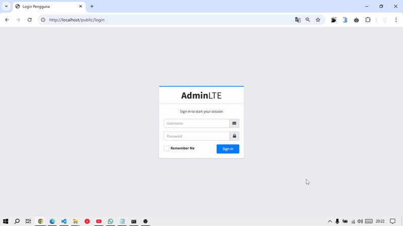
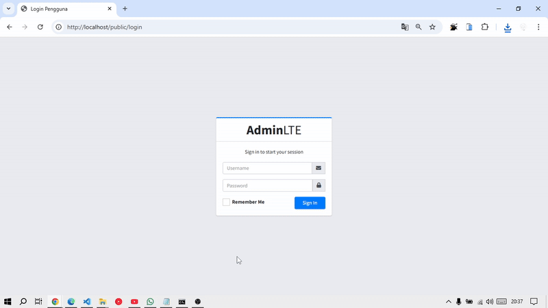
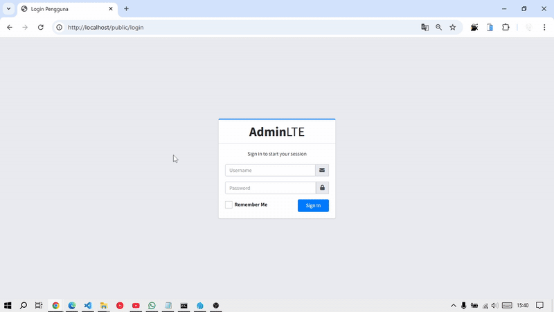
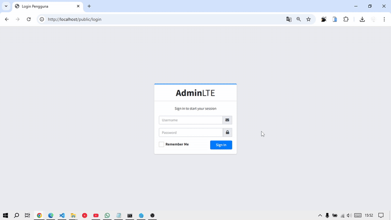
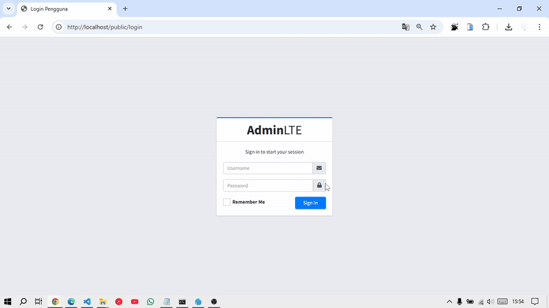
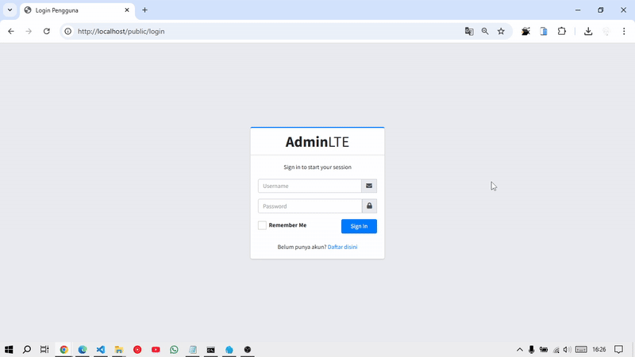

# PWL_POS J7 - Authentication dan Authorization di Laravel

## Praktikum 1 – Implementasi Authentication : 
- Modifikasi file konfigurasi autentikasi di `config/auth.php` agar sesuai dengan model untuk tabel `m_user`.
- Modifikasi `UserModel.php` agar mendukung proses autentikasi.
- Pembuatan `AuthController.php` untuk memproses login dan logout.
- Pembuatan view untuk halaman login di `resources/views/auth/login.blade.php` dengan tampilan yang diambil dari template AdminLTE.

📌 **File yang diubah/dibuat:**
- `config/auth.php`
- `app/Models/UserModel.php`
- `app/Http/Controllers/AuthController.php`
- `resources/views/auth/login.blade.php`

Hasil:<br>


> Tampilan login muncul jika mengakses /public


### Tugas 1 – Implementasi Authentication :
1. Silahkan implementasikan proses login pada project kalian masing-masing (Sudah)
2. Silahkan implementasi proses logout pada halaman web yang kalian buat 

    > disini saya tambahkan tombol logout pada sidebar, yang dimana ketika di klik maka akan mengarah ke halaman login

    

3. Amati dan jelaskan tiap tahapan yang kalian kerjakan, dan jabarkan dalam laporan (Sudah diatas)
4. Submit kode untuk impementasi Authentication pada repository github kalian ([Link Commit](https://github.com/JihaR15/WEBLNJTLARAVEL10/commits/main/Minggu%207/PWL_POS)) 

## Praktikum 2 – Implementasi Authorization di Laravel dengan Middleware :
- Modifikasi `UserModel.php` dengan menambahkan properti/relasi yang mendukung pengecekan role/level.
- Pembuatan middleware `AuthorizeUser.php` menggunakan perintah:
    ```bash
    php artisan make:middleware AuthorizeUser
    ```
- Edit middleware `AuthorizeUser.php`
- Registrasi middleware di file `app/Http/Kernel.php`.
- Modifikasi file `routes/web.php` untuk menerapkan middleware pada route yang ingin dilindungi, misalnya dengan menambahkan keterangan seperti `authorize:ADM` untuk akses administrator.

📌 **File yang diubah/dibuat:**
- `app/Models/UserModel.php`
- `app/Http/Middleware/AuthorizeUser.php`
- `app/Http/Kernel.php`
- `routes/web.php`

Hasil:<br>


> Akses ke route level hanya dapat dilakukan oleh user dengan level "ADM" (Administrator). selain "ADM" maka akan muncul tampilan error 403 seperti ini


### Tugas 2 –  Implementasi Authorization :
1. Apa yang kalian pahami pada praktikum 2 ini? 
    
    > Jadi disini kita membuat middleware AuthorizeUser untuk memfilter akses berdasarkan level user. Di setiap route yang ingin dibatasi aksesnya, kita menambahkan middleware seperti authorize:ADM. Middleware akan mengecek level user dari database, dan jika tidak sesuai, akan diarahkan ke halaman error. Ini mencegah user tidak berwenang mengakses menu admin.
    
2. Amati dan jelaskan tiap tahapan yang kalian kerjakan, dan jabarkan dalam laporan (Sudah)
3. Submit kode untuk impementasi Authorization pada repository github kalian. ([Link Commit](https://github.com/JihaR15/WEBLNJTLARAVEL10/commits/main/Minggu%207/PWL_POS))

## Praktikum 3 – Implementasi Multi-Level Authorizaton di Laravel dengan Middleware
- Modifikasi `UserModel.php` dengan menambahkan fungsi `getRole()` untuk mendapatkan kode level dari user.
- Penyesuaian pada middleware `AuthorizeUser.php` agar mendukung pengecekan multi-level authorization.
- Perbaikan dan pengaturan ulang route di `routes/web.php` agar dapat mengatur hak akses untuk beberapa level user secara dinamis.

📌 **File yang diubah/dibuat:**
- `app/Models/UserModel.php`
- `app/Http/Middleware/AuthorizeUser.php`
- `routes/web.php`

Hasil:<br>

> Route dapat diakses oleh user dengan level berbeda (misal: Admin dan Manager) sesuai dengan pengaturan multi-level authorization.

> Admin: (bisa mengakses level dan barang)


> Manager: (bisa mengakses data barang namun tidak bisa mengakses level karena hak aksesnya ada pada ADM)


> Staff: (tidak memiliki akses ke level dan barang)


### Tugas  3 – Implementasi Multi-Level Authorization :
1. Silahkan implementasikan multi-level authorization pada project kalian masing-masing (Sudah)
2. Amati dan jelaskan tiap tahapan yang kalian kerjakan, dan jabarkan dalam laporan (laporannya merupakan readme ini)
    > Disini kita memodifikasi middleware agar bisa menerima banyak parameter level sekaligus, misalnya authorize:ADM,MAN. Fungsi ini memungkinkan route diakses oleh lebih dari satu level. Contohnya, menu laporan bisa dibuka oleh admin dan manajer. kita menambahkan pengecekan array level user, agar validasi lebih fleksibel dan sesuai kebutuhan aplikasi.
3. Implementasikan multi-level authorization untuk semua Level/Jenis User dan Menu-menu yang sesuai dengan Level/Jenis User 
    1. Admin bisa mengakses semua
    
    2. Manager sementara hanya bisa mengakses kategori dan data barang
    
    3. Staff tidak bisa mengakses milik admin dan manager
    
4. Submit kode untuk impementasi Authorization pada repository github kalian. ([Link Commit](https://github.com/JihaR15/WEBLNJTLARAVEL10/commits/main/Minggu%207/PWL_POS))


### Tugas 4 – Implementasi Form Registrasi :
1. Silahkan implementasikan form untuk registrasi user. ([Sudah](https://github.com/JihaR15/WEBLNJTLARAVEL10/commits/main/Minggu%207/PWL_POS))
2. Screenshot hasil yang kalian kerjakan (Saya record)
    
3. Commit dan push hasil tugas kalian ke masing-masing repo github kalian ([Link Commit](https://github.com/JihaR15/WEBLNJTLARAVEL10/commits/main/Minggu%207/PWL_POS))

