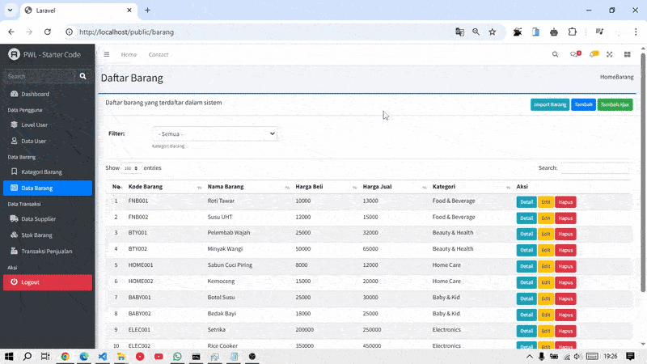
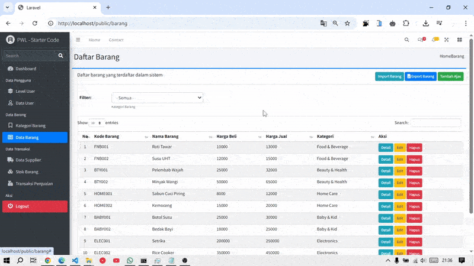

# PWL_POS J8 - File Import dan Export ke PDF dan Excel pada Laravel

## Praktikum 1 – Implementasi Upload File untuk import data:  
- Mengecek tabel `m_kategori` dan `m_barang` pada Database 
- Membuat file `template_barang.xlsx` dan disimpan di `public`
- Modifikasi view pada `barang/index.blade.php` untuk bisa menambahkan tombol menambah form untuk upload untuk import data barang 
- Membuat view untuk form upload/import file excel dan download file 
`template_barang.xlsx`. diberi nama file dengan nama `barang/import.blade.php`
- Modifikasi `route/web.php`
- Install library `phpoffice/phpspreadsheet`.
    ```cmd
    composer require phpoffice/phpspreadsheet
    ```
- Modifikasi file `BarangController.php` untuk memproses data 

📌 **File yang diubah/dibuat:**
- `template_barang.xlsx`
- `resources/views/barang/index.blade.php`
- `resources/views/barang/import.blade.php`
- `routes/web.php`
- `app/Http/Controllers/BarangController.php`
- `composer.json / composer.lock` (phpoffice/phpspreadsheet)

Hasil:<br>

> Disini kita bisa mengimport data barang dari file excel, dan kita juga bisa mendownload template yang sudah dibuat yaitu `template_barang.xlsx`:



### Tugas 1 – Implementasi File Upload untuk Import Data:
1. Silahkan implementasikan praktikum 1 pada project kalian masing-masing untuk semua menu.
2. Amati dan jelaskan tiap tahapan yang kalian kerjakan, dan jabarkan dalam laporan (Sudah pada Readme ini)
3. Submit kode untuk impementasi prakktikum 1 pada repository github kalian. ([Link Commit](https://github.com/JihaR15/WEBLNJTLARAVEL10/commits/main/Minggu%208/PWL_POS))

## Praktikum 2 – Export Data ke Excel :
- Modifikasi `barang/index.blade.php`
- Tambahkan route pada `route/web.php` untuk bisa memproses export excel
- Tambahkan fungsi `export_excel()` pada file `BarangController.php`
    1. Ambil data barang yang akan kita export ke excel (tentu dengan menyertakan relasi kategori barang) 
    2. Load library Spreadsheet dan kita tentukan header data pada baris pertama di excel 
    3. Looping data yang telah kita dapatkan dari database, kemudian kita masukkan ke dalam cell excel
    4. Set lebar tiap kolom di excel untuk menyesuaikan dengan panjang karakter pada masing-masing kolom
    5. Set nama sheet, dan proses untuk dapat di download oleh pengguna

📌 **File yang diubah/dibuat:**
- `resources/views/barang/index.blade.php`
- `routes/web.php`
- `app/Http/Controllers/BarangController.php`

Hasil:<br>

> Disini kita bisa mengexport data yang ada dalam bentuk excel



### Tugas 2 – Implementasi File Export Excel: 
1. Silahkan implementasikan praktikum 2 pada project kalian masing-masing untuk semua 
menu 
2. Amati dan jelaskan tiap tahapan yang kalian kerjakan, dan jabarkan dalam laporan (Sudah)
3. Submit kode untuk impementasi prakktikum 2 pada repository github kalian. ([Link Commit](https://github.com/JihaR15/WEBLNJTLARAVEL10/commits/main/Minggu%208/PWL_POS))

## Praktikum 3 – Implementasi Export PDF di Laravel dengan `dompdf`
- 

📌 **File yang diubah/dibuat:**
- 

Hasil:<br>

> 

<!--  -->


### Tugas 3 – Implementasi Export PDF pada Laravel :
1. Silahkan implementasikan export pdf pada project kalian masing-masing untuk semua 
menu 
2. Amati dan jelaskan tiap tahapan yang kalian kerjakan, dan jabarkan dalam laporan 
3. Submit kode untuk impementasi export pdf pada repository github kalian. 


### Tugas 4 – Implementasi Upload File Gambar :
1. Silahkan implementasikan fitur upload file untuk mengubah foto profile di project web kalian 
2. Jelaskan tiap tahapan yang kalian kerjakan, dan jabarkan dalam laporan 
3. Submit kode untuk impementasi export pdf pada repository github kalian. 

<!-- ([Link Commit](https://github.com/JihaR15/WEBLNJTLARAVEL10/commits/main/Minggu%208/PWL_POS)) -->
